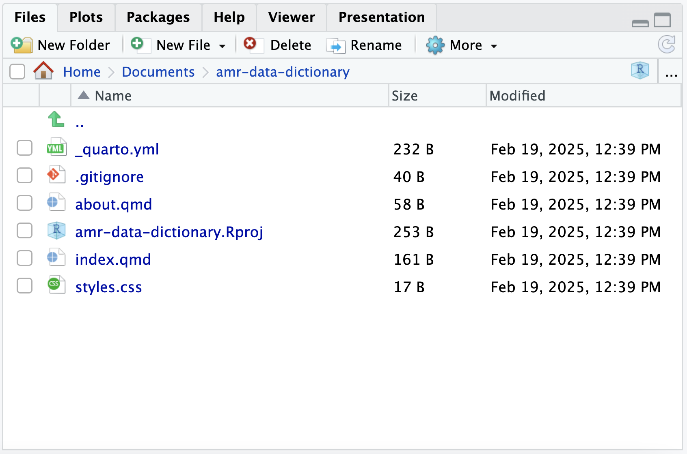
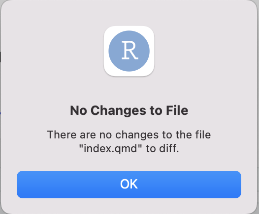
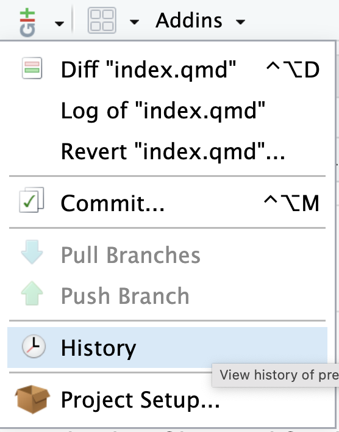
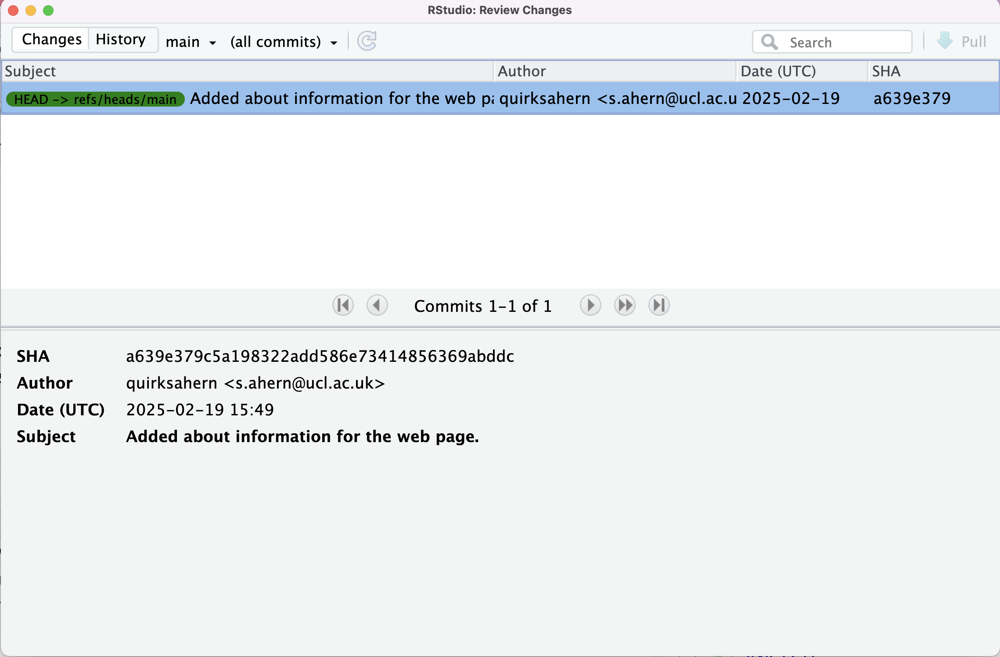

::::::::::::::::::::::::::::::::::::::: objectives

- Go through the modify-add-commit cycle for one or more files.
- Explain where information is stored at each stage of that cycle.
- Distinguish between descriptive and non-descriptive commit messages.

::::::::::::::::::::::::::::::::::::::::::::::::::

:::::::::::::::::::::::::::::::::::::::: questions

- How do I record changes in Git?
- How do I check the status of my version control repository?
- How do I record notes about what changes I made and why?

::::::::::::::::::::::::::::::::::::::::::::::::::

We will be working on our `amr-data-dictionary`project and should be in the `amr-data-dictionary` directory.

{alt='RStudio screenshot showing the current working directory in the Files tab}

We will be editing the file `index.qmd`.

{alt='RStudio screenshot showing the default content of index.qmd automatically created.}

We will start by replacing the initial line of text: `This is a Quarto website.`

With the following text:

```output
## About

This web page will provide metadata information about the data files used 
for the course Introduction to R, databases and reproducibility for AMR epidemiologists.

```
Save your changes to the file.

{alt='RStudio screenshot showing the Diff icon in the Git tab of the uppler left panel.'}

In the Git tab of the upper left panel, we can click on the `Diff` icon.
This will show changes made to `index.qmd`

{alt='RStudio screenshot showing changes made to index.qmd and that these are unstaged.'}

Git has noticed that there are changes to `index.qmd`, and that these are currently unstaged.
Currently, Git doesn't know that it needs to keep track of these changes.

To do this, we can check the box in the Staged column for `index.qmd`

{alt='RStudio screenshot showing staging of index.qmd and change of ? to A under status column.'}

We can see that under status the orange `?` has changed to a green `A` and in the bottom section the radio button for `Staged` is now selected.

Git now knows that it's supposed to keep track of `index.qmd`,
but it hasn't recorded these changes as a commit yet.

{alt='RStudio screenshot showing initial commit message for index.qmd.'}

To get it to do that, we need to type a message in the `Commit message` box and click on `Commit`.

On the completion of the `commit` the following message is displayed in the terminal:

```output
>>> /usr/bin/git commit -F /var/folders/1v/6jw6cbqn1sldcbfrc24vj5qm0000gn/T/RtmpRsFsk9/git-commit-message-617d1bbdcbbe.txt
[main (root-commit) a639e37] Added about information for the web page.
 1 file changed, 13 insertions(+)
 create mode 100644 index.qmd

```

When we run `commit`,
Git takes everything we have told it to save by using `stage`
and stores a copy permanently inside the special `.git` directory.

This permanent copy is called a [commit](../learners/reference.md#commit)
(or [revision](../learners/reference.md#revision)) and its short identifier is `a639e37`. Your commit may have another identifier.

We use the commit message to record a short, descriptive, and specific comment that will help us remember later on what we did and why.

[Good commit messages][commit-messages] start with a brief (\<50 characters) statement about the
changes made in the commit. Generally, the message should complete the sentence "If applied, this commit will" `<commit message here>`.
If you want to go into more detail, add a blank line between the summary line and your additional notes. Use this additional space to explain why you made changes and/or what their impact will be.

We can select `Diff "index.qmd"` from the Git dropdowb menu to show us the current status of the file `index.qmd`.

{alt='RStudio screenshot showing selection of Diff index.qmd on Git dropdown menu.'}

As everything is up to date, a dialogue box appears informing us that there have been no changes to the file.

{alt='RStudio screenshot showing a dialogue box with the text "There are no changes to the file \"index.qmd\" to diff.".'}

If we want to know what we've done recently,
we can ask Git to show us the project's history using the History option from the Git dropdown menu:

{alt='RStudio screenshot showing selection of History on Git dropdown menu.'}

This opens a dialogue box that will lists all commits  made to a repository in reverse chronological order.
The listing for each commit in the upper pane includes includes the log message Git was given when the commit was created, the commit's author, when it was created, and the 
the short identifier.

In the lower pane, we see the same detail for the highlighted commit, however, in this instance the commit's full identifier is shown.

{alt='RStudio screenshot showing details of first commit in Git history.'}
