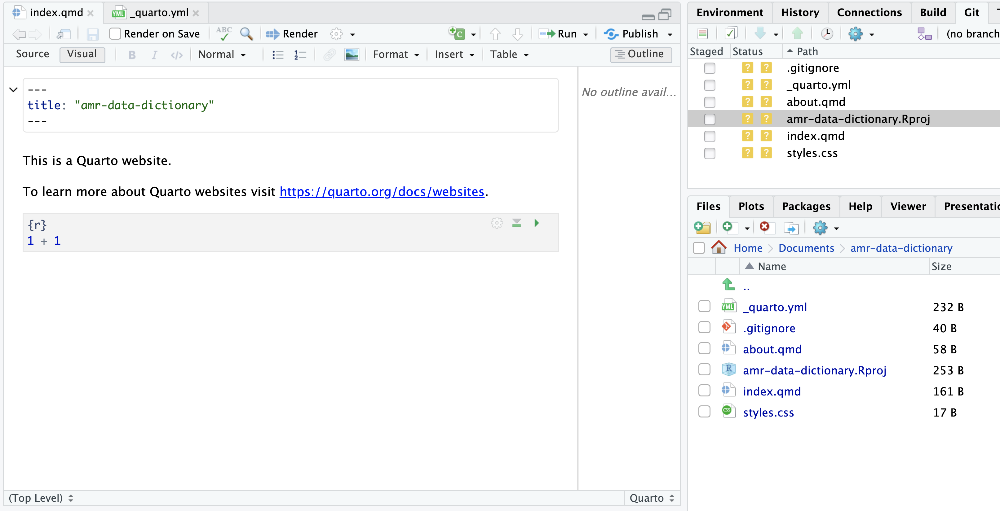
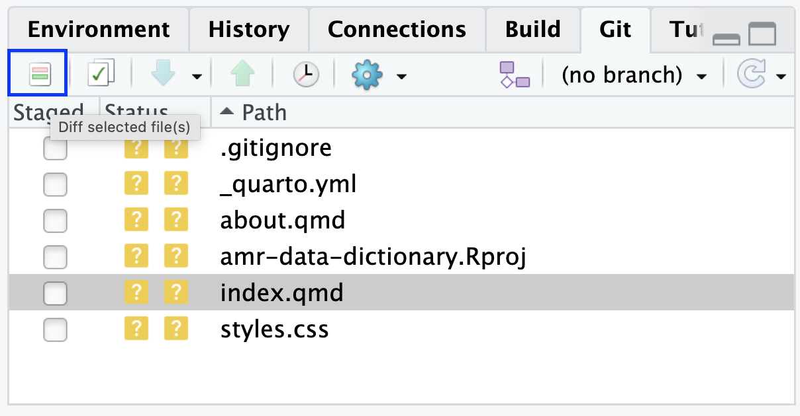
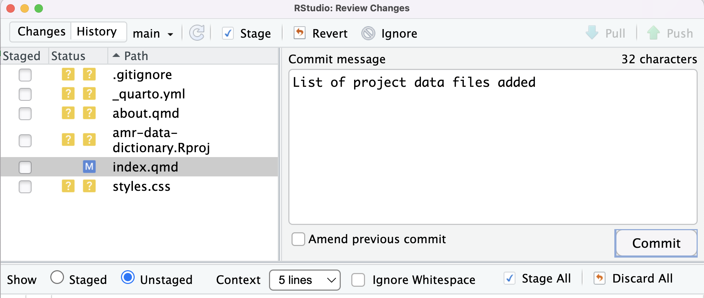
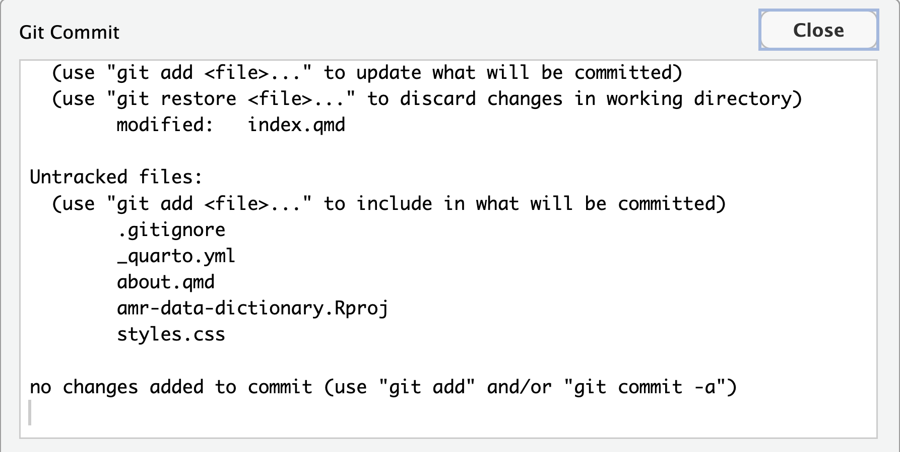
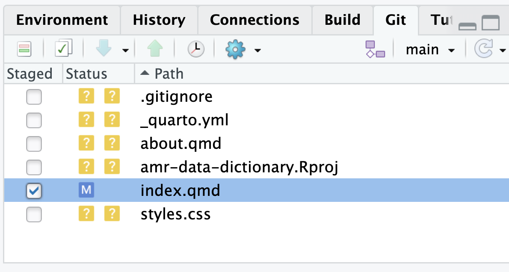
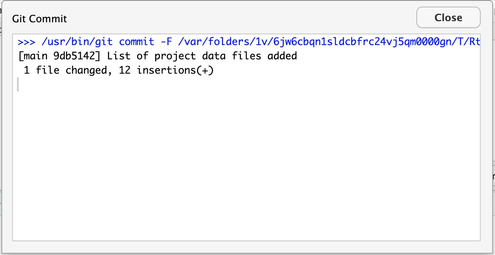
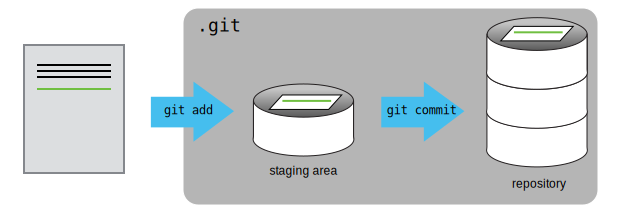
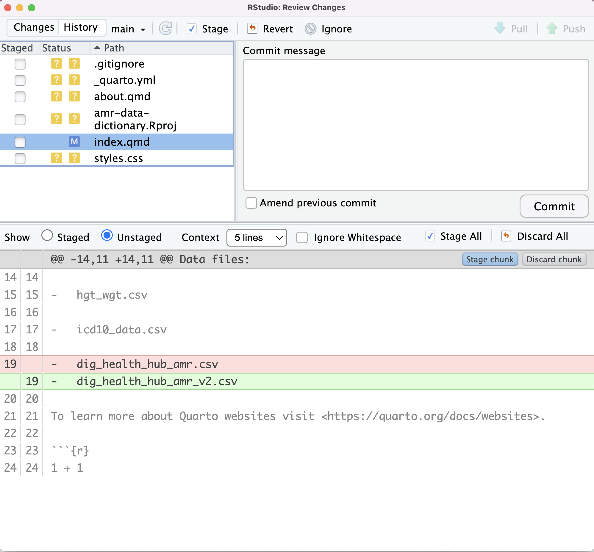
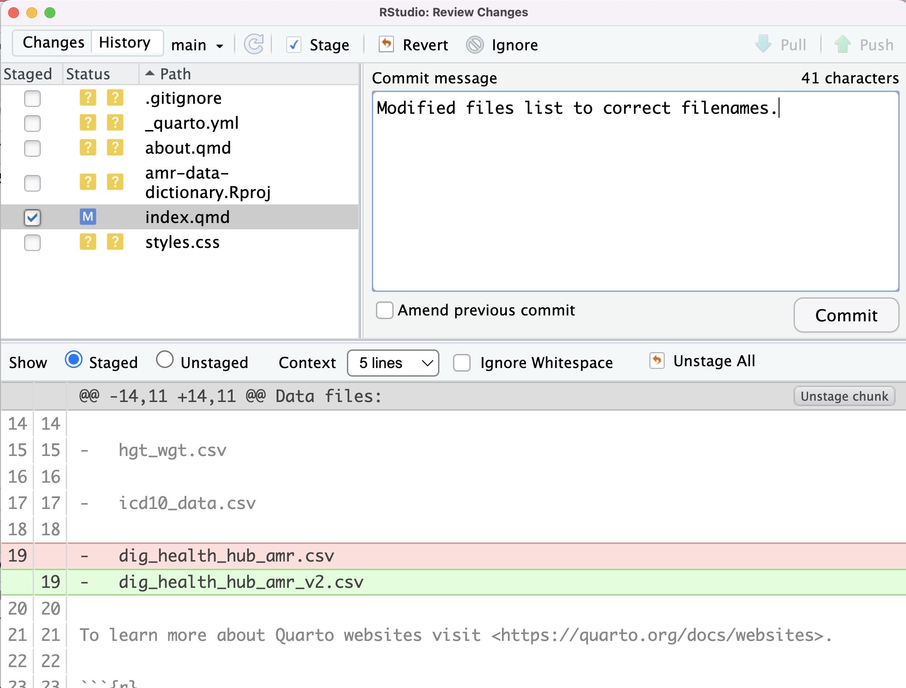
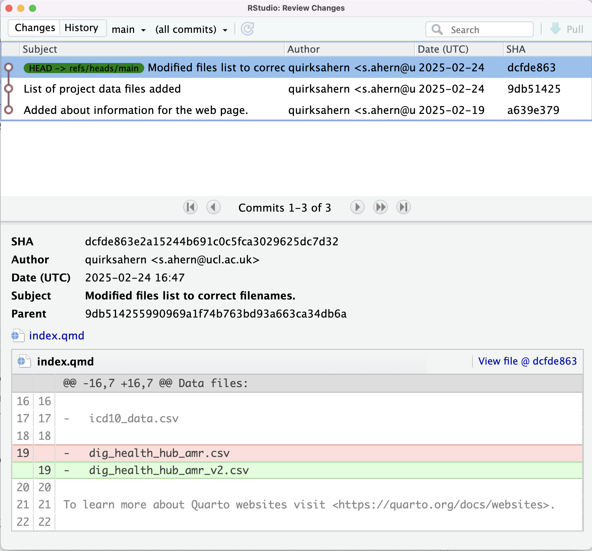

::::::::::::::::::::::::::::::::::::::: objectives

- Go through the modify-add-commit cycle for one or more files.
- Explain where information is stored at each stage of that cycle.
- Distinguish between descriptive and non-descriptive commit messages.

::::::::::::::::::::::::::::::::::::::::::::::::::

:::::::::::::::::::::::::::::::::::::::: questions

- How do I record changes in Git?
- How do I check the status of my version control repository?
- How do I record notes about what changes I made and why?

::::::::::::::::::::::::::::::::::::::::::::::::::

We will be working on our `amr-data-dictionary`project and should be in the `amr-data-dictionary` directory.

{alt='RStudio screenshot showing the current working directory in the Files tab}

We will be editing the file `index.qmd`.

{alt='RStudio screenshot showing the default content of index.qmd automatically created.'}

We will start by replacing the initial line of text: `This is a Quarto website.`

With the following text:

```output
## About

This web page will provide metadata information about the data files used 
for the course Introduction to R, databases and reproducibility for AMR epidemiologists.

```
Save your changes to the file.



In the Git tab of the upper left panel, we can click on the `Diff` icon.
This will show changes made to `index.qmd`


Git has noticed that there are changes to `index.qmd`, and that these are currently unstaged.
Currently, Git doesn't know that it needs to keep track of these changes.

To do this, we can check the box in the Staged column for `index.qmd`


We can see that under status the orange `?` has changed to a green `A` and in the bottom section the radio button for `Staged` is now selected.

Git now knows that it's supposed to keep track of `index.qmd`,
but it hasn't recorded these changes as a commit yet.


To get it to do that, we need to type a message in the `Commit message` box and click on `Commit`.

On the completion of the `commit` the following message is displayed in the terminal:

```output
>>> /usr/bin/git commit -F /var/folders/1v/6jw6cbqn1sldcbfrc24vj5qm0000gn/T/RtmpRsFsk9/git-commit-message-617d1bbdcbbe.txt
[main (root-commit) a639e37] Added about information for the web page.
 1 file changed, 13 insertions(+)
 create mode 100644 index.qmd

```

When we run `commit`,
Git takes everything we have told it to save by using `stage`
and stores a copy permanently inside the special `.git` directory.

This permanent copy is called a [commit](../learners/reference.md#commit)
(or [revision](../learners/reference.md#revision)) and its short identifier is `a639e37`. Your commit may have another identifier.

We use the commit message to record a short, descriptive, and specific comment that will help us remember later on what we did and why.

[Good commit messages][commit-messages] start with a brief (\<50 characters) statement about the
changes made in the commit. Generally, the message should complete the sentence "If applied, this commit will" `<commit message here>`.
If you want to go into more detail, add a blank line between the summary line and your additional notes. Use this additional space to explain why you made changes and/or what their impact will be.

We can select `Diff "index.qmd"` from the Git dropdowb menu to show us the current status of the file `index.qmd`.


As everything is up to date, a dialogue box appears informing us that there have been no changes to the file.


If we want to know what we've done recently,
we can ask Git to show us the project's history using the History option from the Git dropdown menu:


This opens a dialogue box that will lists all commits  made to a repository in reverse chronological order.
The listing for each commit in the upper pane includes includes the log message Git was given when the commit was created, the commit's author, when it was created, and the 
the short identifier.

In the lower pane, we see the same detail for the highlighted commit, however, in this instance the commit's full identifier is shown.


:::::::::::::::::::::::::::::::::::::::::  callout

## Where Are My Changes?

If we look in our Files pane, bottom right, of our RStudio window you will see only 1 version of `index.qmd`.
That's because Git saves information about files' history
in the special `.git` directory mentioned earlier
so that our filesystem doesn't become cluttered
(and so that we can't accidentally edit or delete an old version).

::::::::::::::::::::::::::::::::::::::::::::::::::

Now suppose we want to add more information to the file.
We can open our file `index.qmd`, and add the follow text and save the file:

```output
Data files:
- gapmider_data.csv
- gapminder_wide.csv
- hgt_wgt.csv
- icd10_data.csv
- dig_health_hub_amr.csv
```

If we now choose `Diff index.qmd` from the Git dropdown menu, our changes will be identified:


In the top left panel an `M` has appeared in the Status column next to index.qmd. Also, in the lower panel, the radio button for Unstaged is selected and the text that we have added is highlighted. This enables us to review
our changes before saving them, which is recognised good practiced.

We have reviewed our changes and are happy with them,
but we haven't told Git we will want to save those changes,
nor have we saved them.
So let's do that now. 



Let's enter the following Commit message and click on Commit:

```output
List of project data files added
```



Whoops:
Git won't commit because we didn't use `git add` first.
Let's fix that:



Checking the `Staged` box in the Git tab for index.qmd has "added" the file. Notice also, that the `M` has moved from the right-hand status column to the left-hand column.

We can now,`Commit` the change successfully.



Git insists that we add files to the set we want to commit
before actually committing anything. This allows us to commit our changes in stages and capture changes in logical portions rather than
only large batches.

For example,
suppose we're adding a few citations to relevant research to our thesis.
We might want to commit those additions,
and the corresponding bibliography entries,
but *not* commit some of our work drafting the conclusion
(which we haven't finished yet).

To allow for this,
Git has a special *staging area*
where it keeps track of things that have been added to
the current [changeset](../learners/reference.md#changeset)
but not yet committed.

:::::::::::::::::::::::::::::::::::::::::  callout

## Staging Area

If you think of Git as taking snapshots of changes over the life of a project,
checking `Staged` (`git add`) specifies *what* will go in a snapshot
(putting things in the staging area),
and `Commit`(`git commit`) then *actually takes* the snapshot, and
makes a permanent record of it (as a commit).
If you don't have anything staged when you try to `Commit`,
Git will prompt you to use `git commit -a` or `git commit --all`,
which is kind of like gathering *everyone* to take a group photo!
However, it's almost always better to
explicitly add things to the staging area, because you might
commit changes you forgot you made. (Going back to the group photo simile,
you might get an extra with incomplete makeup walking on
the stage for the picture because you used `-a`!)
Try to stage things manually,
or you might find yourself searching for "git undo commit" more
than you would like!


::::::::::::::::::::::::::::::::::::::::::::::::::



Let's watch as our changes to a file move from our editor
to the staging area and into long-term storage.

First, let's modify our data files list by changing `dig_health_hub_amr.csv` to `dig_health_hub_amr_v2.csv`:

If we select `Diff index.qmd` our change will be highlighted:



So far, so good:
we've replaced one line (shown with a `-` in the first column) with a new line
(shown with a `+` in the first column).

We also have a new options: <kbd>Stage chunk</kbd> and <kbd>Discard chunk</kbd>.

As we want to stage our changes, we will click on `Stage chunk`.

Let's save our changes:



and look at the history  of what we've done so far:



:::::::::::::::::::::::::::::::::::::::::  callout

## Directories

Two important facts you should know about directories in Git.

1. Git does not track directories on their own, only files within them.
  
  Try it for yourself, create the following direcyories within amr-data-dictionary:
  - gapminder
  - dhh-amr
  - hgt-wgt
  - icd10
  
  Note, our newly created empty directory `gapminder` does not appear in
  the list of untracked files even if we explicitly add it (*via* `git add`) to our
  repository. This is the reason why you will sometimes see `.gitkeep` files
  in otherwise empty directories. Unlike `.gitignore`, these files are not special
  and their sole purpose is to populate a directory so that Git adds it to
  the repository. In fact, you can name such files anything you like.

2. If you create a directory in your Git repository and populate it with files,
  you can add all files in the directory at once by selecting `Stage All`.
  

::::::::::::::::::::::::::::::::::::::::::::::::::

To recap, when we want to add changes to our repository,
we first need to add the changed files to the staging area
(`git add`) and then commit the staged changes to the
repository (`git commit`):


:::::::::::::::::::::::::::::::::::::::  challenge

## Choosing a Commit Message

Which of the following commit messages would be most appropriate for the
last commit made to `index.qmd`?

1. "Changes"
2. "Changed dig_health_hub_amr.csv for dig_health_hub_amr_v2.csv"
3. "Corrected file names in data files list"

:::::::::::::::  solution

## Solution

Answer 1 is not descriptive enough, and the purpose of the commit is unclear;
and answer 2 is redundant to using "git diff" to see what changed in this commit;
but answer 3 is good: short, descriptive, and imperative.


:::::::::::::::::::::::::

::::::::::::::::::::::::::::::::::::::::::::::::::


[commit-messages]: https://chris.beams.io/posts/git-commit/
[git-references]: https://git-scm.com/book/en/v2/Git-Internals-Git-References


:::::::::::::::::::::::::::::::::::::::: keypoints

- `Diff` shows the status of a repository.
- Files can be stored in a project's working directory (which users see), the staging area (where the next commit is being built up) and the local repository (where commits are permanently recorded).
- `Stage` puts files in the staging area.
- `Commit` saves the staged content as a new commit in the local repository.
- Write a commit message that accurately describes your changes.

::::::::::::::::::::::::::::::::::::::::::::::::::

